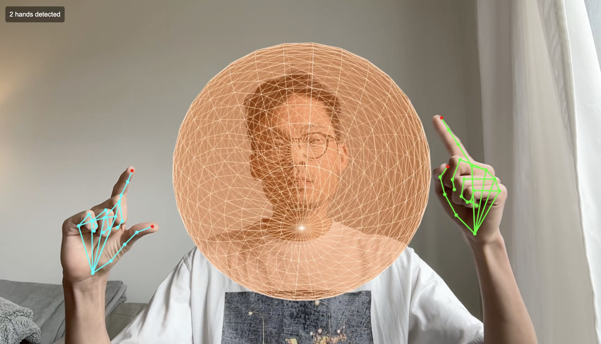

# Hand Tracking + Python Agent Bridge

A collaboration between [@collidingScopes](https://github.com/collidingScopes) and [@seanivore](https://github.com/seanivore) that connects Three.js hand tracking with Python development agents.



## Quick Start

```bash
# Install dependencies
pip install websockets

# Run everything
./start.sh

# Or run manually:
python gesture_server.py
# In another terminal:
python3 -m http.server 8000

# Open in browser:
http://localhost:8000/index_with_agent.html
```

## Hand Gestures → Dev Tools

Use hand gestures to control development workflows:

| Gesture      | Action          | Description                         |
| ------------ | --------------- | ----------------------------------- |
| 👍 Thumbs up  | Run tests       | Execute pytest or create test files |
| ✌️ Peace sign | Git commit      | Create automatic commits            |
| 👋 Wave       | Next suggestion | Get code improvement tips           |
| 👉 Point      | Explain code    | Get explanation at cursor           |
| ✊ Fist       | Emergency stop  | Halt running processes              |

Hold gestures for 500ms to trigger (prevents accidental activation).

## Features

- **Original hand tracking** by collidingScopes with Three.js
- **Gesture detection** with MediaPipe
- **WebSocket bridge** to Python agents
- **Actual dev tool control** - not just demos!
- **Visual feedback** for all interactions

## Project Structure

```
c-scopes-handy-agent/
├── index.html              # Original hand tracking
├── index_with_agent.html   # Enhanced with gestures
├── gesture_server.py       # WebSocket server
├── start.sh               # Quick start script
├── agents/                # Python automation
│   └── vision_command_agent.py
└── docs/                  # Documentation
    ├── CLAUDE.md
    ├── AGENT_README.md
    └── README_INTEGRATED.md
```

## Technical Details

1. **MediaPipe** detects 21 hand landmarks
2. **Custom gesture detection** identifies specific poses
3. **WebSocket** (ws://localhost:8765) bridges browser ↔ Python
4. **Python agents** execute real commands
5. **Three.js** provides visual feedback

## Credits

- Hand tracking visualization: [@measure_plan](https://x.com/measure_plan)
- Original repo: [threejs-handtracking-101](https://github.com/collidingScopes/threejs-handtracking-101)
- Agent integration: [@seanivore](https://github.com/seanivore)

## Future Ideas

- [ ] Hand clap to "smack" objects
- [ ] Two-hand gestures for complex commands
- [ ] AR overlay for code reviews
- [ ] Voice commands integration
- [ ] Custom gesture training

## License

MIT - See original repository for details
